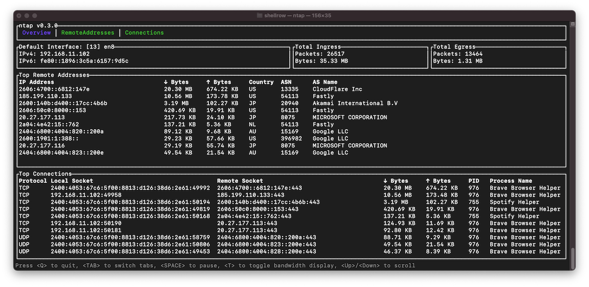

[crates-badge]: https://img.shields.io/crates/v/ntap.svg
[crates-url]: https://crates.io/crates/ntap
[license-badge]: https://img.shields.io/crates/l/ntap.svg

# ntap [![Crates.io][crates-badge]][crates-url] ![License][license-badge]

## Overview
**ntap** is a real-time network utilization monitoring tool.  
It provides comprehensive insights into your network's activity, enabling users to monitor traffic, manage connections, and view network configurations with ease.

  

## Features
- **Real-time Monitoring**: Track network utilization as it happens.
- **Connection Management**: Analyze active connections quickly and effectively.
- **Interface and Routing Insights**: Get detailed views of network interfaces and routing tables.

## Prerequisites
- Ensure you have a compatible operating system (Linux, macOS, Windows).

## Installation

### Install prebuilt binaries via shell script

```sh
curl --proto '=https' --tlsv1.2 -LsSf https://github.com/shellrow/ntap/releases/latest/download/ntap-installer.sh | sh
```

### Install prebuilt binaries via powershell script

```sh
irm https://github.com/shellrow/ntap/releases/latest/download/ntap-installer.ps1 | iex
```

### Install prebuilt binaries via Homebrew

```sh
brew install shellrow/tap-ntap/ntap
```

### From Releases
You can download archives of precompiled binaries from the [releases](https://github.com/shellrow/ntap/releases) 

### Using Cargo

```sh
cargo install ntap
```

Or you can use [binstall](https://github.com/cargo-bins/cargo-binstall) for install ntap from github release.
```sh
cargo binstall ntap
```

#### Build from source
First, clone the repository:
```
git clone https://github.com/shellrow/ntap
```
Then, build the project:
```
cd ntap
cargo build --release
./target/release/ntap
```

## Post-Install Configuration

The following post-install configuration steps are applicable to both the CLI version (`ntap`) and the desktop application (`ntap-desktop`).  
These steps ensure that `ntap` has the necessary permissions and environment setup to function correctly on different operating systems.

### Post-Install (Linux)

`ntap` requires elevated privileges to monitor network packets effectively. On Linux, you can configure these privileges using two main methods:

#### 1. Using `setcap`

Granting capabilities to the `ntap` binary allows it to operate with the necessary privileges without requiring `sudo` for each execution.  
This method is recommended for single-user machines or in environments where all users are trusted.

Assign necessary capabilities to the `ntap` binary
```sh
sudo setcap 'cap_sys_ptrace,cap_dac_read_search,cap_net_raw,cap_net_admin+ep' $(command -v ntap)
```

Run `ntap` as an unprivileged user:
```sh
ntap
```

#### Capabilities Explained:
- `cap_sys_ptrace,cap_dac_read_search`: Allows `ntap` to access `/proc/<pid>/fd/` to identify which open port belongs to which process.
- `cap_net_raw,cap_net_admin`: Enables packet capturing capabilities.

#### 2. Using `sudo` (for multi-user environments)
For environments with multiple users, requiring privilege escalation each time `ntap` is run can enhance security.
```
sudo ntap
```

### Post-Install (macOS)
On macOS, managing access to the Berkeley Packet Filter (BPF) devices is necessary for `ntap` to monitor network traffic:
#### Install `chmod-bpf` to automatically manage permissions for BPF devices:

Install prebuilt binaries via shell script
```
curl --proto '=https' --tlsv1.2 -LsSf https://github.com/shellrow/chmod-bpf/releases/latest/download/chmod-bpf-installer.sh | sh
```

Install prebuilt binaries via Homebrew
```sh
brew install shellrow/tap-chmod-bpf/chmod-bpf
```

#### Check BPF device permissions
```
chmod-bpf check
```

#### Install the chmod-bpf daemon to automatically manage BPF device permissions
```
sudo chmod-bpf install
```

### Post-Install (Windows)
- Ensure that you have [Npcap](https://npcap.com/#download) installed, which is necessary for packet capturing on Windows
- Download and install Npcap from [Npcap](https://npcap.com/#download). Choose the "Install Npcap in WinPcap API-compatible Mode" during installation.

### License
`ntap` is released under the MIT License. See the LICENSE file for more details.
